# yellow-x402-agent

x402 HTTP Payment Required flow backed by Yellow state channels.
**2 on-chain transactions** (open + close), **N instant off-chain payments** in between — no sequencer, no facilitator.

---

## What this is

A buyer agent and a paid resource service that speak the x402 protocol.  The buyer opens a state channel with ClearNode (1 on-chain tx), makes multiple paid requests via instant ClearNode ledger transfers, then closes the channel (1 on-chain tx).  The service confirms each payment by receiving a `"tr"` push notification from ClearNode.

---

## Architecture Comparison

This diagram contrasts a traditional "On-Chain" x402 implementation against the "Yellow Network State Channel" approach, specifically for High-Frequency AI Agent scenarios.

Imagine **1,000 AI Agents** attempting to buy market data every second.

```mermaid
flowchart LR
    %% Global Styling
    classDef plain fill:#fff,stroke:#9e9e9e,stroke-width:1px,color:#000;
    classDef red fill:#ffebee,stroke:#c62828,stroke-width:2px,color:#c62828;
    classDef gold fill:#fffde7,stroke:gold,stroke-width:2px,color:#af861f;
    
    %% Left Side: Traditional
    subgraph TRADITIONAL ["TRADITIONAL x402 (The Problem)"]
        direction TB
        T_Agents("🤖 1,000 Agents"):::plain
        T_API("📡 Service API"):::plain
        L1("⛓️ Ethereum L1"):::red
        
        T_Agents -->|"1. GET /price"| T_API
        T_API -->|"2. 402 Pay"| T_Agents
        T_Agents -->|"3. TX ($$$ GAS)"| L1
        L1 -.-|"4. CONGESTION"| L1
        L1 -->|"5. Confirmed (15s+)"| T_API
        T_API -->|"6. Data"| T_Agents

        Err[/"❌ NETWORK CLOGGED<br/>❌ FEES > DATA VALUE<br/>❌ LATENCY KILLS ALPHA"/]:::red
        L1 --- Err
    end

    %% Right Side: Yellow
    subgraph YELLOW ["🟡 YELLOW NETWORK (The Solution)"]
        direction TB
        Y_Agents("🤖 1,000 Agents"):::gold
        Y_API("⚡ Service API"):::gold
        Node["🟡 ClearNode (State Channel)"]:::gold
        Custody("🔒 L1 Custody"):::plain
        
        %% Setup
        Y_Agents --"1. Open Channel"--> Custody
        Custody -.-o Node

        %% Fast Loop
        Y_Agents -->|"2. GET /price"| Y_API
        Y_API -->|"3. 402 Pay"| Y_Agents
        
        Y_Agents -->|"4. SIGN & SEND"| Node
        Node -->|"5. INSTANT SETTLE"| Node
        Node -.->|"6. 'tr' PUSH"| Y_API
        Y_API -->|"7. DATA Leased (ms)"| Y_Agents

        Win[/"✅ INSTANT FINALITY<br/>✅ ZERO GAS / TX<br/>✅ UNLIMITED TPS"/]:::gold
        Node --- Win
    end

    %% Styles for Yellow Loop (Indices stripped to fix render error)

```



### Breakdown

| Feature | Traditional x402 (On-Chain) | Yellow Network x402 (State Channels) |
| :--- | :--- | :--- |
| **Cost per Request** | **$2 - $50** (Gas Fees) | **$0.00** (Zero Gas) |
| **Speed** | **12s - Minutes** (Block time) | **Milliseconds** (Network latency) |
| **Throughput** | **15 - 50 TPS** (Network limit) | **Unlimited** (Peer-to-Peer) |
| **Viability for AI** | ❌ Impossible for HFT | ✅ Perfect for Streaming Payments |

---

## File structure

```
yellow-x402-agent/
├── .env                        ← wallet keys + config (never commit)
├── .env.example                ← template
├── package.json
├── tsconfig.json
└── src/
    ├── lib/
    │   └── yellow-client.ts    ← shared ClearNode WebSocket client
    ├── service/
    │   └── index.ts            ← Express: requirePayment middleware + 3 paid routes
    └── buyer/
        └── index.ts            ← agent: full session lifecycle (create → pay → settle)
```

---

## Setup

### 1. Dependencies

```sh
cd yellow-x402-agent
npm install
```

### 2. Environment

Copy `.env.example` to `.env` and fill in two funded sandbox wallet keys:

```env
CLEARNET_URL=wss://clearnet-sandbox.yellow.com/ws

BUYER_PRIVATE_KEY=0x...          # funded with ytest.usd on sandbox
SERVICE_PRIVATE_KEY=0x...        # funded with ytest.usd on sandbox (different key)

SERVICE_PORT=4000
PRICE=1000000                    # ytest.usd base units (default for /resource)
SERVICE_URL=http://localhost:4000

# On-chain settlement (Sepolia)
CHAIN_ID=11155111
TOKEN_ADDRESS=0xDB9F293e3898c9E5536A3be1b0C56c89d2b32DEb   # ytest.usd on sandbox
# Buyer wallet needs Sepolia ETH for gas (auto-funded on sandbox)
```

Both accounts are auto-funded by the ClearNode sandbox faucet on first auth.
Use different keys for buyer and service — you cannot transfer to yourself.

### 3. Run

Two terminals:

```sh
# Terminal 1 — start the paid service
npm run service
# wait for: [service] HTTP on http://localhost:4000

# Terminal 2 — run the buyer agent
npm run buyer
```

---

## The flow (step by step)

1. **Service starts**, connects to ClearNode, authenticates, begins listening for `"tr"` transfer notifications.
2. **Buyer starts**, connects to ClearNode, authenticates.
3. **② Buyer opens a channel** — sends `createCreateChannelMessage` to ClearNode.  ClearNode returns a signed initial state (`channel_id`, `server_signature`, `allocations`).  If a channel from a previous run is still open, the buyer reuses it (handles the `"already exists"` error gracefully).
4. **③ Paid requests** — buyer hits three endpoints sequentially (these use ClearNode ledger transfers and do NOT require the channel to be on-chain):

   | Endpoint    | Price (ytest.usd) | Response data          |
   |-------------|-------------------|------------------------|
   | `/resource` | 1 000 000         | Premium resource quote |
   | `/data`     | 500 000           | Analytics data         |
   | `/quote`    | 200 000           | Live market quote      |

   Each endpoint follows the same sub-flow:
   - `GET /endpoint` → **402** with `{ accepts: [{ scheme: "yellow", … }] }`
   - Buyer calls `yellow.transfer()` → ClearNode ledger transfer (instant, no gas) → receipt `{ id, from_account, to_account, … }`
   - Buyer builds `X-PAYMENT` header (base64 JSON with `transactionId`)
   - `GET /endpoint` with `X-PAYMENT` → service polls notification cache (up to 3 s), verifies asset + amount + dest → **200** with resource

5. **⑤a On-chain create** — buyer submits the signed initial state to the Sepolia custody contract via `NitroliteClient.createChannel()`.  This is on-chain transaction **#1**.  Buyer waits 3 seconds for ClearNode to index the new on-chain channel.  (Skipped if the channel was already on-chain from a previous run.)
6. **④ Close channel** — buyer sends `createCloseChannelMessage`.  ClearNode returns the signed final state.  (This only works after step 5 because ClearNode needs to see the channel on-chain.)
7. **⑤b On-chain close** — buyer submits the signed final state to Sepolia via `NitroliteClient.closeChannel()`.  This is on-chain transaction **#2**.  Funds are released according to the final allocations.

---

## Key implementation details

### Token address

ClearNode sandbox uses a single test token (`ytest.usd`) on all chains:

```
0xDB9F293e3898c9E5536A3be1b0C56c89d2b32DEb
```

Discoverable via `createGetConfigMessage` → first response method is `"assets"` (NOT `"get_config"` — that response contains only network/broker info).  The buyer hardcodes this as the default; set `TOKEN_ADDRESS` in `.env` to override.

### ClearNode uses snake_case

Transaction objects on the wire use snake_case, not camelCase:

| Actual field      | NOT this        |
|-------------------|-----------------|
| `from_account`    | `fromAccount`   |
| `to_account`      | `toAccount`     |
| `tx_type`         | `txType`        |
| `created_at`      | `createdAt`     |
| `from_account_tag`| `fromAccountTag`|
| `to_account_tag`  | `toAccountTag`  |

Config responses also use `chain_id` (not `chainId`).

### RPC method names are abbreviated

| Method string | Meaning                  |
|---------------|--------------------------|
| `"tr"`        | TransferNotification     |
| `"transfer"`  | Transfer response        |
| `"assets"`    | Assets list (response to getConfig) |
| `"get_config"`| Network/broker config    |
| `"create_channel"` | Channel creation response |
| `"close_channel"`  | Channel close response    |
| `"error"`     | RPC error (must NOT be emitted as Node `'error'` event) |
| `"bu"`        | BalanceUpdate            |
| `"cu"`        | ChannelUpdate            |

### Channel lifecycle ordering

`close_channel` RPC only works **after** the channel has been registered on-chain.  The correct sequence is:

```
create_channel RPC  →  on-chain createChannel  →  (wait for indexing)  →  close_channel RPC  →  on-chain closeChannel
```

If `close_channel` is called before the on-chain create, ClearNode returns `"channel … not found"`.

### Stale channels

ClearNode allows only **one open channel per wallet-broker pair**.  If a previous run created a channel on-chain but didn't close it, the next `create_channel` RPC returns:

```
"an open channel with broker already exists: 0x…"
```

The buyer extracts the channel ID from this error and skips straight to `close_channel` + on-chain close.

### Error routing in the WebSocket client

ClearNode sends errors as `{ res: [id, "error", { error: "…" }] }`.  Node.js EventEmitter throws on unhandled `'error'` events, so the message router explicitly checks for `method === "error"` and routes it to a `'rpc_error'` event instead of the generic emit.

### Auth flow

Both client and service use the same EIP-712 handshake:

1. Send `createAuthRequestMessage` with address, session key, allowances, expiry.
2. ClearNode pushes back `auth_challenge` with a challenge string.
3. Sign it with `createEIP712AuthMessageSigner` (local — no RPC).
4. Send `createAuthVerifyMessageFromChallenge`.
5. ClearNode responds with `auth_verify` → authenticated.

Session key is an ephemeral keypair generated per connection.  It signs all subsequent RPC messages — the main wallet key is only used for the EIP-712 auth signature.

### Service payment confirmation

The service does NOT verify cryptographic signatures on transfers.  It trusts ClearNode as the source of truth: if a `"tr"` notification arrived with the matching `transactionId`, the payment happened.  It sanity-checks asset, amount, and destination against its own config.

If the notification hasn't arrived when the retry request comes in, the service polls the cache for up to 3 seconds (30 × 100 ms) before rejecting.

---

## Contract addresses (Sepolia sandbox)

| Contract     | Address                                      |
|--------------|----------------------------------------------|
| Custody      | `0x019B65A265EB3363822f2752141b3dF16131b262` |
| Adjudicator  | `0x7c7ccbc98469190849BCC6c926307794fDfB11F2` |
| Broker       | `0xc7E6827ad9DA2c89188fAEd836F9285E6bFdCCCC` |
| ytest.usd    | `0xDB9F293e3898c9E5536A3be1b0C56c89d2b32DEb` |
